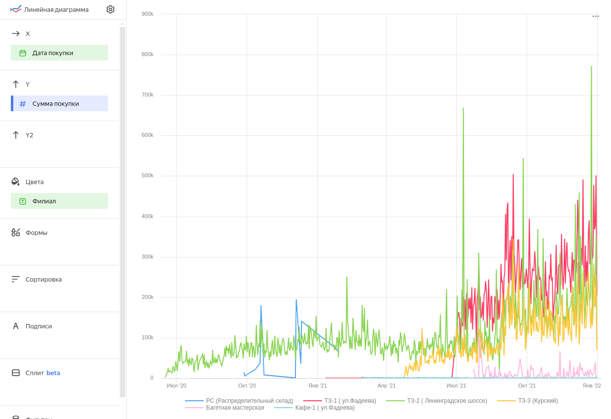
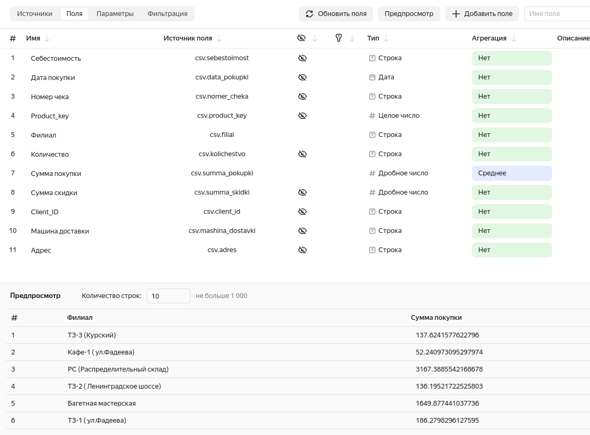
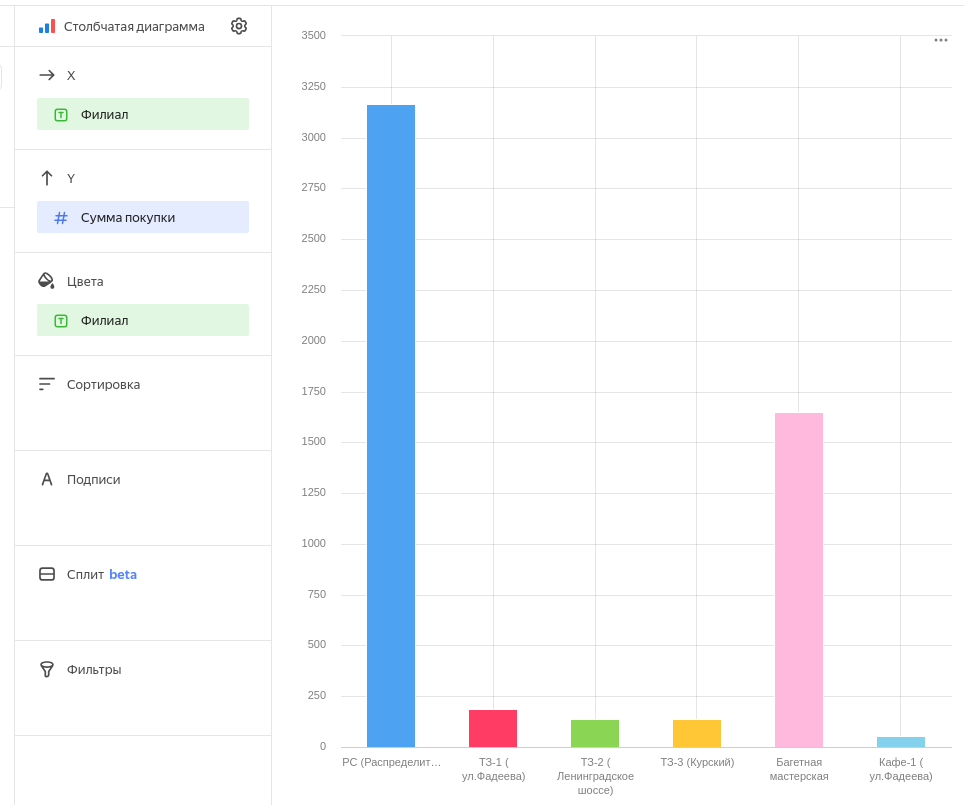
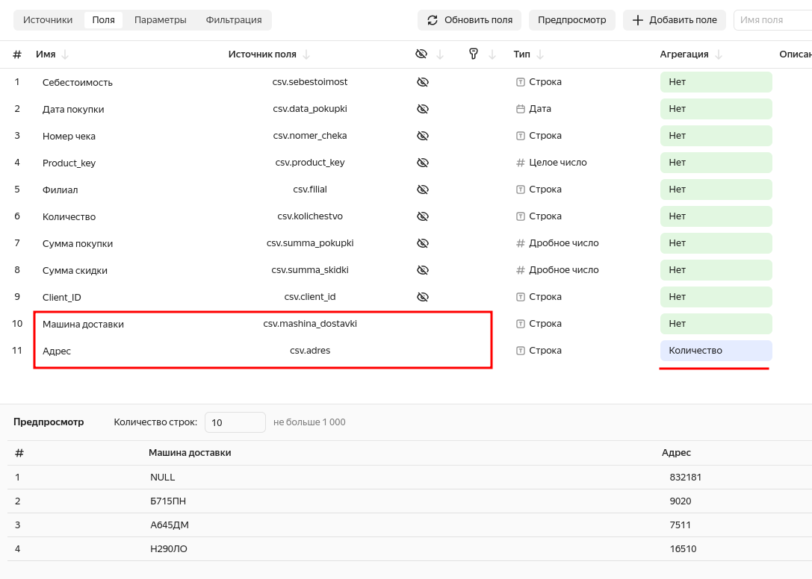
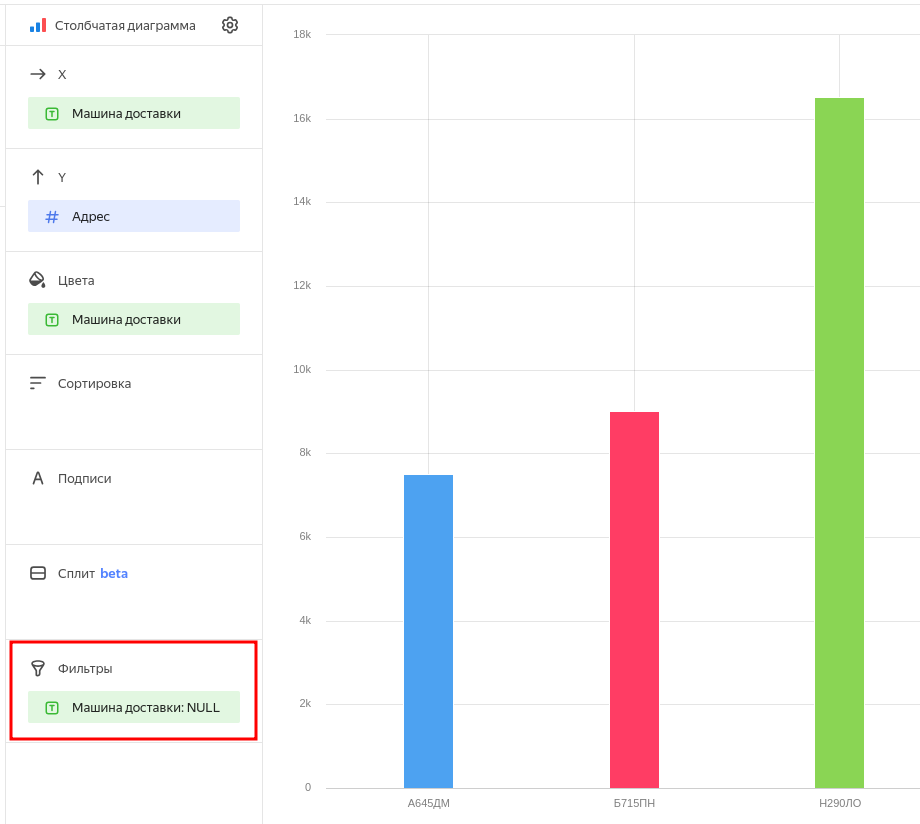
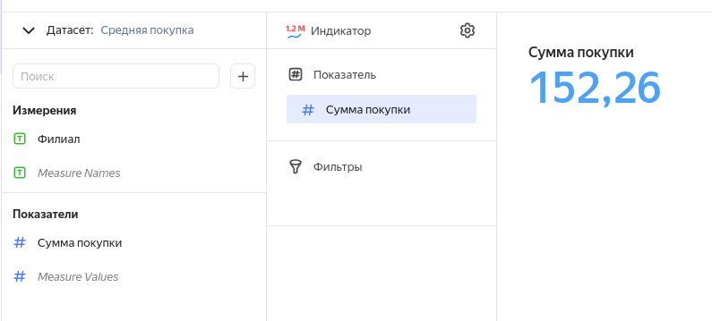

# Практическая работа No4. Визуализация данных

1. Создайте линейную диаграмму показателей покупки на каждый день.

    * Отобразите линейные диаграммы «суммы покупки» от «даты покупки» с цветом «Филиал».
    
        
    
    * Установите, какие филиалы работают в данный момент, какие уже не работают. 
    
        На конец диапазона не работает "РС (Распределительный склад)"

    * Установите, какой филиал самый прибыльный, а какой менее по средней покупке.

        РС (Распределительный склад) (На этом графике не видно, видно в следующем задании)

2. Сгруппируйте данные по чекам, датам и клиентам. Сформируйте в
системе обработки данных выборку, для использования в визуализации
данных среднего чека по столбцу сумма покупки.

    Сделал датасет с агрегатной функцией (среднее) (но группирую только продажи по сумме продаж)

    

    По этому датасету сделал столбчатый график

    

3. С помощью столбчатой диаграммы сформируйте график количества
адресов для каждой машины доставки.region3

    Датасет:

    

    Большинство адресов не привязаны к машинам, поэтому добавил фильтр

    

4. Создайте график индикатора средней покупки.

    

5. Создайте, на свое усмотрение, 2 визуализации, помогающие понять эффективность работы службы доставки товаров. Если нужны дополнительные расчеты, воспользуйтесь Loginom или Python для вычисления группировок и агрегаций, после чего результат в виде таблицы данных погрузите отдельной таблицей в подключения и создайте датасет.

6. Вывести все графики на один дашборд с фильтрацией по дате покупки.

Представленной работой поделиться через ссылку с помощью функции
«публичный доступ».
